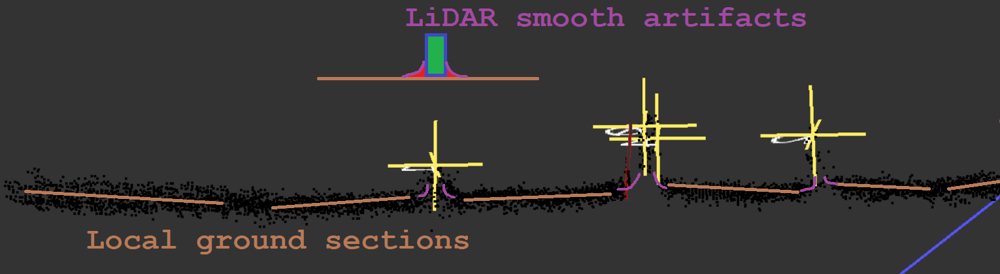

# Noteworthy

## Artifacts
* While the LiDAR is looking at a flat surface we still get uneven pointcloud. Shown as brown lines.
* Rectancular objects on top of flat surface gets smoothed out points in the corners. Shown as purple lines.

## Sampling issue
A false estimation of the ground can happen when sampling is done between ground points and object points.
This can be prevented by checking the green points if they are flat then its ground and not a potential object.

## Multiple clusters
How do we seperate clusters?

* Green points `C` are clusters points.
* White cross is the random selected point `s` of clusters point.
* The yellow cross is trackers at position `x`.

Finding the position of one cluster can be done by simply selecting any point. The point is garanteed to be close to only one cluster.
By selected a random point there will be a chance that the point will be in any cluster.

A tracker position `x` will be put at the selected point `s`. 
A cluster is considered labeled when the tracker localy tracks that cluster.

Only initial luck using multiple iterations is required to succesfully label all clusters. After that all cluster is tracked by trackers.

## Smart sampling
When doing a local sample of the pointcloud there is a chance that it will fail to detect.
Its smart to remember the last sample position of a successfull detection. The end of the bluelines represent the sample position and the other end represent object position.

## Edge Detect. Near 90 deg angle of incidence i.e. no reflection
Objects have geometry that wraps around it self thus it will have a edge where LIDAR reflaction incidence is near or equal 90 degress which makes it physicly impossible to reflect.

