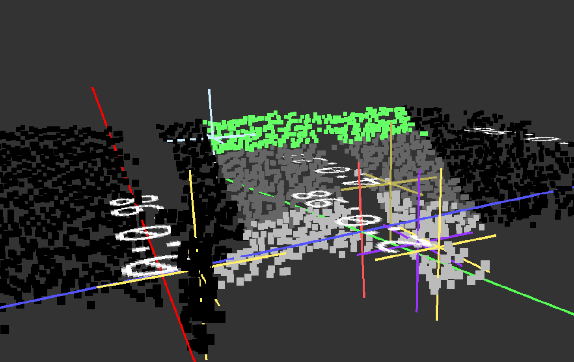

# Noteworthy

## Artifacts
* While the LiDAR is looking at a flat surface we still get uneven pointcloud.
* Rectancular objects on top of flat surface gets smoothed out points in the corners.

## Sampling issue
A false estimation of the ground can happen when sampling is done between ground points and object points.

## Multiple clusters

* Green points are clusters points  `C`.
* White cross is the random selected point `s` of clusters point.
* The yellow cross is trackers at position `x`.

Finding the position of one cluster can be done by simply selecting any point. The point is garanteed to be close to only one cluster.
By selected a random point there will be a chance that the point will be in any cluster.

A tracker position `x` will be put at the selected point `s`. 
A cluster is considered labeled when the tracker localy tracks that cluster.

Only initial luck using multiple iterations is required to succesfully label all clusters. After that all cluster is tracked by trackers.

